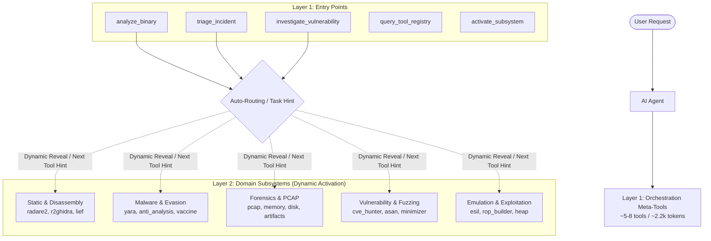

# Progressive Tool Disclosure Architecture (v3.1.0 Design Specification)

## 1. Executive Summary

As Reversecore MCP has grown to **151 specialized security tools**, the tool definitions and JSON schemas exposed during MCP session initialization consume **112.6 KB (~28,834 tokens)**. For AI agents operating in 64k or 128k context windows, this represents substantial token overhead, increased latency, and a higher probability of tool hallucination.

While the **tool profile filtering** introduced in v3.0.4 (`static`, `malware`, `forensics`, `vuln-research`) successfully reduced schema footprint by **37% to 68%**, **Progressive Disclosure** (scheduled for v3.1.0) introduces dynamic, hierarchical tool exposition. Instead of exposing tens of granular tools upfront, the server initially presents a compact set of **high-level orchestration tools (<10 tools, ~2,500 tokens)** and dynamically reveals specialized subsystems on demand.

---

## 2. The Context Consumption Problem

```
+-----------------------------------------------------------------------------------+
|                        MCP Handshake Context Window                               |
+-----------------------------------------------------------------------------------+
|  Default Full Catalog (151 tools) : ~28,834 tokens (112.6 KB JSON Schema)        |
|  Profile Filtering (57-103 tools) : ~9,300 - 17,900 tokens (36.4 - 70.2 KB)      |
|  Progressive Disclosure (L1: 5-8) : ~2,200 tokens (8.5 KB)  [-92.3% vs Full]     |
+-----------------------------------------------------------------------------------+
```

### Key Challenges
1. **Initial Context Tax**: An LLM agent loses ~28k tokens of reasoning memory before the user even submits their first prompt.
2. **Tool Selection Hallucination**: With 151 tools having overlapping parameters, smaller models frequently misroute requests (e.g., attempting to decompile with Radare2 list functions or invoking crash triage on PE stubs).
3. **Turn-by-Turn Cost**: In multi-turn chat sessions with tool schemas re-injected or maintained in context, token billing accumulates rapidly.

---

## 3. Three-Tier Architectural Hierarchy



---

## 4. Layer 1 Orchestration Specification

### 4.1 `analyze_binary`
General-purpose binary analysis entry point. Identifies file architecture, format, hashes, entropy, embedded strings, and recommended downstream tools.
- **Parameters**:
  - `file_path` (str, required): Absolute path to the binary.
  - `task` (enum, optional): `auto` (default), `reverse`, `malware`, `unpack`.
  - `decompile` (bool, optional): If `True`, automatically decompiles the entrypoint / `main`.
- **Output**:
  - Unified analysis summary: Architecture, bitness, entrypoint, compiler/packer info, high-entropy sections.
  - `recommended_tools`: List of specific tools with invocation arguments to continue analysis.

### 4.2 `triage_incident`
Digital forensics entry point. Automatically accepts PCAP files, memory dumps, disk images, or artifact bundles.
- **Parameters**:
  - `target_path` (str, required): Path to capture file, memory image, or artifact directory.
  - `focus` (enum, optional): `auto`, `network_c2`, `dns_beacon`, `injected_code`.
- **Output**:
  - Protocol breakdown, top connections, detected anomalies, candidate IoCs.
  - Direct next steps and relevant Layer 2 tool disclosures.

### 4.3 `investigate_vulnerability`
Crash analysis and security delta entry point.
- **Parameters**:
  - `crash_log` (str, optional): ASan, UBSan, or GDB crash trace.
  - `target_v1` (str, optional): Original or unpatched binary.
  - `target_v2` (str, optional): Patched binary.
- **Output**:
  - Bug classification, CWE mapping, faulting function, PoC reproduction steps, or security patch verdict.

### 4.4 `query_tool_registry` & `activate_subsystem`
Allows an agent to discover and activate specialized tool namespaces during deep investigative turns:
```json
{
  "subsystem": "emulation",
  "revealed_tools": [
    "r2_emulate_execution",
    "r2_emulate_step",
    "r2_emulate_registers"
  ]
}
```

---

## 5. Next-Tool Steering Contract

Every tool execution in Reversecore MCP returns a structured `hints` section within `ToolResult`:
```json
{
  "status": "success",
  "data": { ... },
  "hints": {
    "next_tool": "r2_decompile",
    "suggested_args": {
      "file_path": "/app/workspace/target",
      "function_name": "main"
    },
    "reasoning": "Discovered main function at 0x401000. Decompilation recommended."
  }
}
```
This guarantees that even when tools are disclosed progressively, the agent is deterministically guided along valid analysis chains without trial-and-error querying.

---

## 6. Migration and Compatibility Matrix

| Mode | Configuration | Initial Tool Count | Use Case |
|---|---|:---:|---|
| **Legacy Full** | Default / `REVERSECORE_PROFILE=full` | 151 | Unrestricted local dev & comprehensive test suites |
| **Domain Profiles** | `REVERSECORE_PROFILE=static\|malware\|...` | 57 - 103 | Focused tasks with static tool sets |
| **Progressive Disclosure** | `REVERSECORE_PROGRESSIVE=1` (v3.1.0) | 5 - 8 | Ultra-low context budget, multi-agent systems, cost optimization |

---

## 7. Implementation Roadmap (v3.1.0)

1. **Sprint 1: Meta-Tool Synthesis**
   - Implement `analyze_binary` unifying `run_file`, `lief_summary`, and entrypoint decompilation.
   - Implement `triage_incident` unifying `pcap_analyze`, `pcap_extract_dns`, and `artifact_correlate_ioc`.
2. **Sprint 2: FastMCP Dynamic Tool Discovery**
   - Hook FastMCP's dynamic tool registration hooks to support `activate_subsystem`.
3. **Sprint 3: Benchmark & E2E Validation**
   - Add E2E verification test `test_progressive_disclosure_flow`.
   - Update `docs/benchmarks/profile_footprint.md` with L1 metrics.
