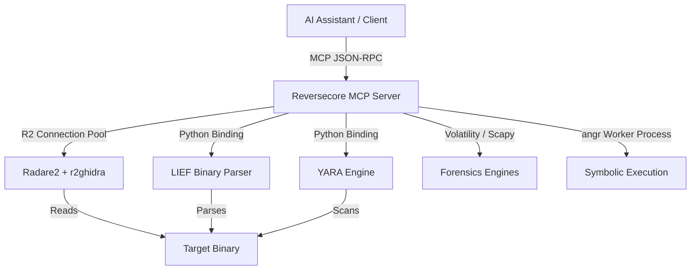

# Reversecore MCP

Welcome to **Reversecore MCP** - an AI-powered security analysis and reverse engineering platform built on the Model Context Protocol (MCP).

## What is Reversecore MCP?

Reversecore MCP provides AI assistants (like Claude, Cursor, and others) with a powerful, sandboxed suite of binary analysis, vulnerability research, and digital forensics tools:

- **Static Analysis**: Disassembly, native decompilation, and metadata parsing.
- **Dynamic Analysis**: Code emulation and trace-based execution mapping.
- **Threat Detection**: Automated backdoor discovery, YARA rule generation, and vulnerability hunting.
- **Digital Forensics**: Memory forensics, disk inspection, and PCAP network capture analysis.
- **SAST**: Source code auditing for Python, C, and C++.

---

## Quick Start

### Docker (Recommended)

Run the pre-built multi-arch Docker image with your local analysis workspace mounted:

```bash
docker run -i --rm \
  -v /path/to/your/samples:/app/workspace \
  -e REVERSECORE_WORKSPACE=/app/workspace \
  -e MCP_TRANSPORT=stdio \
  ghcr.io/sjkim1127/reversecore_mcp:latest
```

### From Source

```bash
git clone https://github.com/sjkim1127/Reversecore_MCP.git
cd Reversecore_MCP
python -m venv venv && source venv/bin/activate
pip install -r requirements.txt
python server.py
```

---

## Features

### 🔍 Binary Analysis & Decompilation
- **Radare2 Integration**: Pool-based stateful connection pool to execute binary commands.
- **r2ghidra Decompiler**: High-quality pseudo-C decompilation powered by the embedded native Ghidra decompiler engine (no JVM or Java required).
- **LIEF Parser**: Structured parsing of PE, ELF, and Mach-O headers, sections, imports, and exports.
- **Capstone & Keystone**: Multi-architecture disassembly (x86/ARM/MIPS/etc.) and instruction assembly.

### 🛡️ Threat Detection & Defense
- **Dormant Detector**: Scan for hidden backdoors, logic bombs, anti-sandbox/anti-VM tricks, and orphan functions.
- **Adaptive Vaccine**: Generate YARA detection rules and propose binary neutralizing patches automatically.
- **Vulnerability Hunter**: Identify dangerous library calls (e.g. buffer overflows) and detect ROP gadget chains.
- **YARA Engine**: Scan files and directories with custom or standard YARA signature rules.

### 🕵️ Digital Forensics
- **Memory Forensics**: Volatility3-powered analysis of process tables, network sockets, and injected code.
- **Network Capture**: Scapy-based PCAP analysis for DNS requests, HTTP traffic, and protocol anomalies.
- **Disk & Artifacts**: Parse registry hives, event logs, browser histories, and Sleuth Kit disk images.

### 📊 Structured Triage Reports
- **MITRE ATT&CK Mapping**: Map analyzed behaviors to standard ATT&CK technique IDs.
- **Analysis Sessions**: Track triage metrics, elapsed time, and collected IOCs during interactive AI sessions.
- **Export Formats**: Generate summaries, triages, or full reports in Markdown, HTML, or JSON.

---

## Architecture



---

## Documentation Index

- **Getting Started**:
    - [Installation Guide](getting-started/installation.md)
    - [Quick Start Guide](getting-started/quickstart.md)
    - [Configuration Options](getting-started/configuration.md)
- **User Guides**:
    - [Architecture Overview](development/architecture.md)
    - [Static & Binary Analysis](user-guide/binary-analysis.md)
    - [pseudo-C Decompilation](user-guide/decompilation.md)
    - [Malware & Threat Detection](user-guide/threat-detection.md)
- **Developer Resource**:
    - [Contributing Guide](development/contributing.md)
    - [Testing & Quality Assurance](development/testing.md)
    - [API Reference](api/core/config.md)

## License

MIT License - see [LICENSE](https://github.com/sjkim1127/Reversecore_MCP/blob/main/LICENSE)
